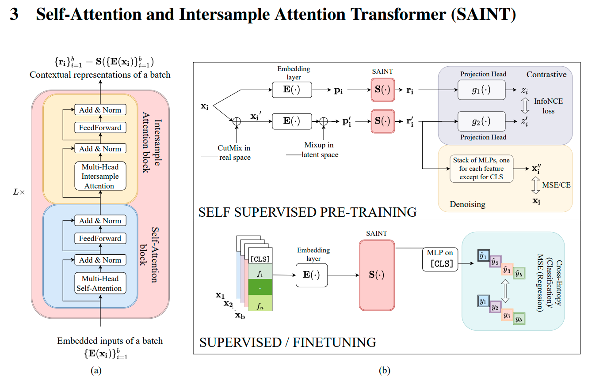

# SAINT: Improved Neural Networks for Tabular Data via Row Attention and Contrastive Pretraining

We got AUROC of 92.9% on bank dataset with initial experiments. More experiments coming soon.

Major modules implemented in the code

- Saint Transformer
- Saint Intersample Transformer
- Embeddings for tabular data
- Mixup
- CutMix
- Contrastive Loss
- Denoising Loss

## How to use code

1. Process dataset in the following format:
    - Add cls column to dataset. 'cls' column has to be the first column as mentioned in paper
    - Apply z-transform to numerical columns
    - Label encode categorical columns
    - Concatenate cat and num columns, with cat columns coming first, then numerical ones
    - Calculate the number of categorical columns \(including 'cls' column\), and numerical columns. Add to config file as 'no_cat' and 'no_num'
    - Calculate the number of categories in each categorical columns, as a list. Add to config file as 'cats'. 'cls' column has 1 category
    - Sample function `preprocess_bank` can be used to preprocess bank dataset. It can be found in `src > dataset.py`
    - Save files in train, val and test csv in `data` folder
1. Clone the repository
1. Setup a new environment using `requirements.txt` in repo
1. Setup configuration in `config.py` file
1. Run `python main.py` with command-line arguments or with edited config file.

> `>> python main.py --model saint_i --experiment ssl`

to train saint model in self-supervised mode.

### TODO

1. Evaluate on more datasets
1. Optimize the embedding layer for fast retrieval of embeddings
1. Improve documentation

### Contributors

- [Ahmed A. Elhag](https://github.com/Ahmed-A-A-Elhag)
- [Aisha Alaagib](https://github.com/AishaAlaagib)
- [Amina Rufai](https://github.com/Aminah92)
- [Amna Ahmed Elmustapha](https://github.com/AMNAALMGLY)
- [Jamal Hussein](https://github.com/engmubarak48)
- [Mohammedelfatih Salah](https://github.com/mohammedElfatihSalah)
- [Ruba Mutasim](https://github.com/ruba128)
- [Sewade Olaolu Ogun](https://github.com/ogunlao)

(names in alphabetical order)
